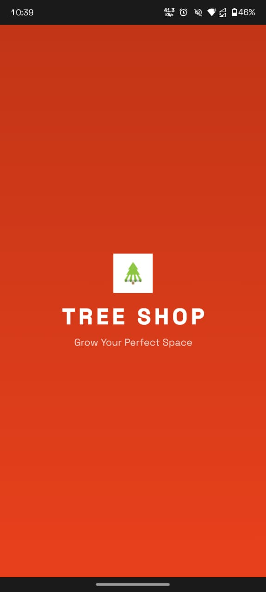
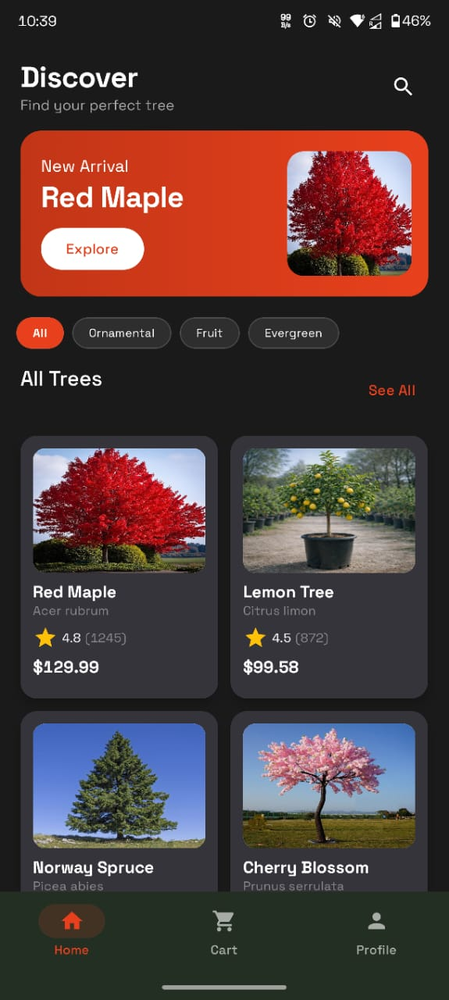
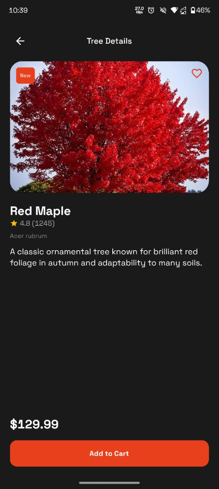
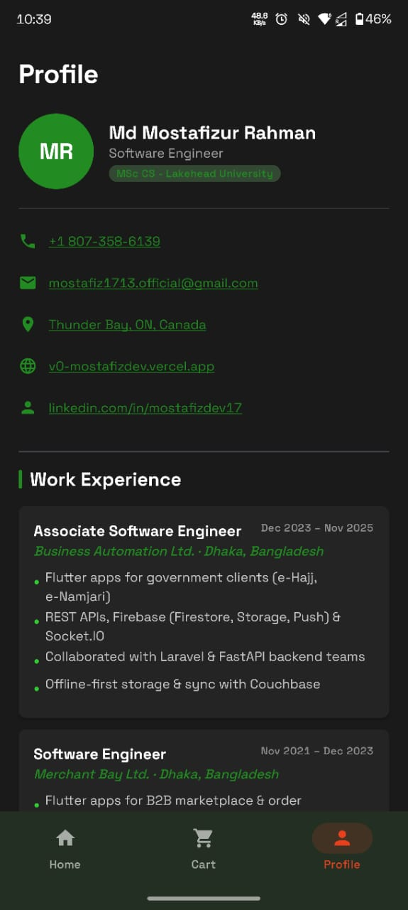

# 🌳 TreeShop — Kotlin Jetpack Compose

A mobile tree shopping app built with **Kotlin + Jetpack Compose**, implementing a full product listing, detail view experience.

---

## 📸 Screenshots

<table>
  <tr>
    <td align="center">
      
      <br/><sub><b>Splash Screen</b></sub>
    </td>
    <td align="center">
      
      <br/><sub><b>Home Screen</b></sub>
    </td>
  </tr>
  <tr>
    <td align="center">
      
      <br/><sub><b>Product Detail</b></sub>
    </td>
    <td align="center">
      
      <br/><sub><b>Cart Screen</b></sub>
    </td>
  </tr>
</table>

> 📁 Place your screenshots in `assets/screenshots/` and rename them to match the filenames above.

---

## 📁 Project Structure

```
TreeShop/
├── app/
│   └── src/main/
│       ├── AndroidManifest.xml
│       ├── java/com/treeshop/app/
│       │   ├── MainActivity.kt              ← Entry point + Navigation
│       │   ├── Screen.kt                    ← Navigation routes (sealed class)
│       │   ├── data/
│       │   │   └── ShopRepository.kt        ← In-memory product data source
│       │   ├── model/
│       │   │   └── Tree.kt                  ← Data models (Tree)
│       │   ├── viewmodel/
│       │   │   └── CartViewModel.kt         ← Cart state management (StateFlow)
│       │   └── ui/
│       │       ├── theme/
│       │       │   ├── Color.kt             ← App color palette
│       │       │   ├── Typography.kt        ← Text styles
│       │       │   └── Theme.kt             ← MaterialTheme setup
│       │       ├── components/
│       │       │   └── BottomNavBar.kt      ← Bottom navigation bar composable
│       │       │   └── CategoryChip.kt      ← Chip for category filtering
│       │       │   └── TreeCard.kt          ← Product card composable for listing and detail screens
│       │       └── screens/
│       │           ├── SplashScreen.kt      ← Animated launch screen
│       │           ├── HomeScreen.kt        ← Product listing + category filter + hero banner
│       │           ├── ProductDetailScreen.kt ← Detail view with color/size selector
│       │           └── CartScreen.kt        ← Cart with quantity controls + order total
│       │           └── ProfileScreen.kt     ← Profile placeholder screen
│       └── res/
│           └── values/
│               ├── strings.xml
│               └── themes.xml
├── assets/
│   └── screenshots/                         ← 📸 Add your screenshots here
│       ├── splash_screen.png
│       ├── home_screen.png
│       ├── product_detail.png
│       └── cart_screen.png
├── build.gradle.kts
├── settings.gradle.kts
└── gradle/
    └── libs.versions.toml               ← Version catalog
```

---

## 🚀 How to Run

### Prerequisites
- Android Studio
- JDK 11+
- Android SDK 24+

### Steps
1. Clone or unzip the project
2. Open **Android Studio** → `File > Open` → select the `TreeShop` folder
3. Wait for Gradle sync to complete
4. Connect an Android device or start an emulator (API 24+)
5. Press **▶ Run** (`Shift+F10`)

---

## ✨ Features

| Feature | Description |
|---|---|
| Splash Screen | Animated brand intro |
| Home Screen | Grid of products + category filter chips + hero banner |
| Product Detail | Rating, description |
| Add to Bag | Add items directly from detail view |
| Navigation | Jetpack Navigation Compose with back stack |
| State Management | `CartViewModel` with `StateFlow` |

---

## 🏗️ Architecture

- **MVVM** — ViewModel holds cart state, UI observes via `collectAsState()`
- **Single Activity** — Navigation handled by `NavHost` in `MainActivity`
- **In-Memory Data** — `ShopRepository` singleton (no database required per specs)
- **Jetpack Compose** — 100% declarative UI, no XML layouts

---

## 📦 Dependencies

| Library | Purpose |
|---|---|
| `androidx.navigation:navigation-compose` | Screen navigation |
| `androidx.lifecycle:lifecycle-viewmodel-compose` | ViewModel in Compose |
| `androidx.compose.material:material-icons-extended` | Extended icon set |
| `androidx.compose.material3` | Material 3 UI components |